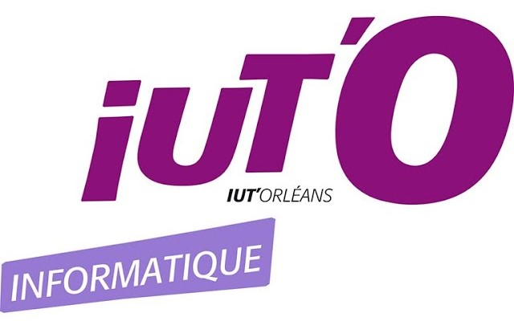

<div align="center">
<br><br><br><br><br><br><br><br><br><br><br><br><br><br><br><br>
<h1><strong>SAE Crypto</strong></h1>
Réalisé par Daniel MOREIRA (groupe 22), Cassandra MAUPOU (groupe 23) <br>
Année : 2023/2024
</div>
<div style="page-break-after: always;"></div>

## **Questions**
### **Partie 1 : Premières tentatives**

1. *En supposant que RSA soit utilisé correctement, Eve peut-elle espérer en venir à bout ? En vous appuyant sur votre cours, justifiez votre réponse.*

Si le chiffrement symétrique est déjà effectué, Eve ne pourra pas deviner les clés que le protocole RSA aura généré. De plus, si elle souhaitait déchiffrer les messages envoyés entre Alice et Bob, elle aurait besoin de créer sa propre clé de liaison avec Bob et une autre avec Alice.
Cependant, il existe tout de même une manière de casse ce protocole en procédant à une factorisation du nombre représentant le module de chiffrement.
De plus, si elle essayait de casser le protocole RSA avec un algorithme classique, le temps nécessaire à la réalisation de cette factorisation augmente de façon exponentielle suivant la longueur de la clé.


2. *En quoi l’algorithme SDES est-il peu sécurisé ? Vous justifierez votre réponse en analysant le nombre d’essai nécessaire à une méthode “force brute” pour retrouver la clé.*

L'algorithme SDES est vulnérable aux attaques utilisant une méthode de force brute. Comme cet algorithme utilise une clé très courte (10 bits), il n'existe pas beaucoup de possibilités et la méthode citée ci-dessus peut en quelques secondes déchiffrer un message chiffré par cet algorithme. Pour donner un ordre d'idée, avec nos ordinateurs, cela prend environ 0.030 ms à casser via une méthode de force brute qui va tester toutes les possiblités.


3. *Est-ce que le double SDES est-il vraiment plus sûr ?*

Cet algorithme est particulièrement vulnérable aux attaques utilisant la méthode Meet in the Middle.
Cette méthode est généralement utilisée lorsqu'une méthode de cryptage chiffre un message plusieurs fois. Meet in the Middle est plus rapide qu'une méthode de force brute, cette méthode a besoin de connaître une partie du message chiffré et du message en clair pour ensuite chercher les clés qui ont été utilisées pour chiffrer le message.
A cause de la méthode Meet in the Middle, on ne peut pas affirmer que le double SDES est plus sûr que l'agorithme SDES.


4. *Quelle(s) information(s) supplémentaire(s) Eve doit-elle récupérer afin de pouvoir espérer venir à bout du double DES plus rapidement qu’avec un algorithme brutal ? Décrivez cette méthode astucieuse et précisez le nombre d’essai pour trouver la clé.*

Si Eve veut espérer venir à bout du double DES, elle aura besoin d'avoir du message chiffrée et du message clair, pour reduire le nombre de possiblité de clées nous utilisont l'égalitée $decrypt(cle2, message_chiffre) = encrypt(cle, message_clair)$, Au lieu d'avoir $2 \times 2^{10}$ nous avons $2^{10} + 2^{10}$


### **Partie 2 : Un peu d'aide**

1. *Est-ce vraiment un problème ? Justifiez votre réponse.*

Oui parce qu'il faut maintenant générer une clé de 256 bits.

2. *Nous allons tenter d'illustrer expérimentalement les différences entre les deux protocoles. Vous évaluerez :*
    1. *Le temps d'exécution du chiffrement/déchiffrement d'un message avec chacun des deux protocoles. Ici vous devez le mesurer **expérimentalement** et donc fournir le code Python associé.*

    Avec le protocole SDES, l'encryptage et le decryptage dure environ 15.59ms.
    Avec le protocole AES-256 CBC, l'encryptage et le decryptage dure environ 15.65ms
    Pour les tests du protocole SDES, nous avons utilisée les fonctions donnée, Et pour les tests du protocoles AES-256 CBC, nous avons utilisée les librairise python cryptography et Pycryptodome.

    2. *Le temps de cassage d'AES (même pour un cassage astucieux) si vous deviez l'exécuter sur votre ordinateur. Ici il faut uniquement **estimer** le temps nécessaire.*

    En considerant que nous n'avons pas trouvée de cassage astucieux, le plus astucieux c'est le cassage brutal qui va testée $2^{256}$ possiblité de clée.
    Donc Le temps nécessaire pour casser l'AES serait d'environ $1.81 \times 10^{78} ms$, soit $1.81 \times 10^{75} s$, soit $3.02 \times 10^{73} min$, soit $5.03 \times 10^{71} h$, soit $2.1 \times 10^{70} jours$, soit $5.75 \times 10^{67} ans $, (en considerant 1 an = 365 jours), soit $5.75 \times 10^{64} Milénaire$, 
    soit $1.25 \times 10^{58}$ fois plus que l'âge de notre systeme solaire (en considerant que l'âge du systeme solaire = $4.6 \times 10^9$)
    ou $4.16 \times 10^{57}$ fois plus que l'âge de l'univers (en considerant que l'âge de l'univers = $13.8 \times 10^9$).

3. *Il existe d'autres types d'attaques que de tester les différentes possibilités de clés. Lesquelles ? Vous donnerez une explication succincte de l'une d'elles.*


### **Partie 3 : Analyse des messages**

Voici pour cette partie, le code que nous avons réalisé :
```python
from cryptography.hazmat.backends import default_backend
from cryptography.hazmat.primitives.ciphers import Cipher, algorithms, modes
from scapy.all import *

def decrypt_aes_cbc(key, iv, ciphertext):
    """Permet de décrypter un message chiffré avec AES en mode CBC

    Args:
        key (String): la clé de chiffrement
        iv (String): le vercteur d'initialisation
        ciphertext (String): le message sans le vecteur d'initialisation

    Returns:
        String: Le message decrypté
    """
    cipher = Cipher(algorithms.AES(key), modes.CBC(iv), backend=default_backend())
    decryptor = cipher.decryptor()
    decrypted_message = decryptor.update(ciphertext) + decryptor.finalize()
    return decrypted_message

def remove_iv_and_unpad(payload):
    """Permet de retirer le vecteur d'initialisation et de retirer le padding du message

    Args:
        payload (String): le contenu du packet

    Returns:
        String: un tuble contenant le vecteur d'initialisation et le message sans le padding
    """
    iv = payload[:16]
    encrypted_message = payload[16:]
    unpadded_message = encrypted_message
    return iv, unpadded_message

def decode_packet(packet, key64bits):
    """Permet de décoder un packet UDP et de le décrypter avec AES en mode CBC avec la clé key64bits et de le retourner en utf-8 si le port est 9999

    Args:
        packet (packet): le packet à décoder
        key64bits (String): la clé de 64 bits à utiliser pour le décryptage

    Returns:
        String: Le message décrypté en utf-8
    """
    key = int(key64bits, 2).to_bytes((len(key64bits) + 7) // 8, byteorder='big')
    key = key*4
    if packet.haslayer("UDP") and packet["UDP"].dport == 9999:
            payload = bytes(packet["UDP"].payload)
            iv, encrypted_message = remove_iv_and_unpad(payload)
            decrypted_message = decrypt_aes_cbc(key, iv, encrypted_message)
            decoded_message = decrypted_message.decode("utf-8")
            return decoded_message

# on récupère les packets
packets = rdpcap('./Defi 2/analyse_trace/trace_sae.cap')
# on récupère la clé de 64 bits qui été dans l'image roussignol2
key64bits = '1110011101101101001100010011111110010010101110011001000001001100'

for packetline in packets:
    message = decode_packet(packetline, key64bits)
    if message:
        print(message)
        continue
```

### **Partie 4 : Un peu de recul**

1. *Alice et Bob utilisent toujours la même clé. Est-ce une bonne pratique ?*

Non, le fait d'utiliser toujours la même clé pose des problèmes de sécurité. Si jamais elle est trouvée ou même partagée, il est possible pour n'importe qui de décrypter les messages envoyés.
Une bonne pratique serait plutôt de regénérer une clé selon un certain laps de temps.

2. *Le protocole **PlutotBonneConfidentialité** est inspiré d'un vrai protocole réseau. Lequel ? Décrivez la partie associée à la certification des clés qui est absente de **PlutotBonneConfidentialité**.*

Le protocole *PlutotBonneConfidentialité* est inspiré du protocole TLS (anciennement SSL).
Lorsqu'un client se connecte via ce protocole, une authentification est effectuée. Cette authentification n'est possible que grâce à une certification donnée par une authorité de certification. Cette certification peut être vue comme une carte d'identité numérique qui permet d'identifier un client ou une entreprise sur internet.
Pour obtenir un certificat, il faut demander à une authorité de certification de nous en délivrer un.
Cependant, il existe plusieurs types de certificats :
- La certification DV (Domain Validated) : pour sécuriser un site internet.
- La certification OV (Organisation Validated) : pour sécuriser le site d'une organisation.
- La certification EV (Extended Validated) : prodigue une sécurité renforcée d'un site (Présence d'une barre verte dans la barre de navigation).
- La certification RGS : pour les administrations publiques. Cette certification est reconnue par l'administration française.

3. *Il n'y a pas que pour l'échange de mots doux qu'un tel protocole peut se révéler utile... Donnez au moins deux autres exemples de contexte où cela peut se révéler utile.*

Ce protocole peut se révéler utile également pour :
- l'authentification d'un serveur
- l'intégrité des messages échangés
- l'authentification d'un client (théoriquement)

4. *Connaissez-vous des applications de messagerie utilisant des mécanismes de chiffrement similaires ? (On parle parfois de chiffrement *de bout en bout*) ? Citez-en au moins deux et décrivez brièvement les mécanismes cryptographiques sous-jacent.*

- WhatsApp : 
    - Le chiffrement de bout en bout est appliqué pour toutes les conversations. Ce qui signifie que seuls le ou les destinataires d'un message peuvent décrypter le message de l'expéditeur.
    - En utilisant le protocole Signal, WhatsApp utilise des clés éphémères ainsi que des clés de chiffrement symétrique pour chaque message. Les clés sont générées périodiquement.

- iMessage : une messagerie développée par Apple
    - Le protocole de chiffrement utilisé combine des techniques de chiffrement symétrique et asymétrique. Grâce à un autre protocole (Diffie-Hellman), l'application échange les clés entre les utilisateurs concernés et utilise une clé de session pour chiffrer symétriquement le message envoyé.

5. *Récemment, différents projets de loi et règlements (CSAR, EARN IT Act) visent à inciter voir obliger les fournisseurs de services numériques à pouvoir déchiffrer (et donc analyser) les communications de leur.e.s utilisateurs.rices. Discutez des arguments en faveur ou contre ces législations, notamment en matière de vie privée.*

En ce qui concerne les différents projets de loi, nous sommes tous les deux d'accord pour dire que cela présente plusieurs problèmes, bien qu'il y est également un intérêt.

Tout d'abord, cela présente un problème concernant la vie privée des utilisateurs. Nous avons le droit de communiquer avec d'autres personnes sans que nos discussions ne soient espionnées. De plus, cela présente un risque pour les fournisseurs de service. Si leurs clients apprennent qu'ils sont surveillés, ils peuvent très bien décider de ne plus leur faire confiance.

Ensuite, cela pose une question au niveau de la sécurité des données qui seront collectées. Est-ce que des mesures seront prises pour faire en sorte que les données récoltées seront protégées correctement ? Etant donné que les données collectées sont des données à caractère personnel, il faut d'autant plus faire attention quant à la sécurité de ces dernières.

Des abus peuvent également se produire. Qui sait ce que les fournisseurs de services numériques pourraient être amenés à faire avec autant de données à leur portée ? Même si des restrictions pourraient être prévues pour éviter ce genre de problème, rien ne dit que cela ne risque pas d'arriver.

Concernant les points positifs, ils concernent surtout l'impact que cela aurait à l'échelle nationale.

Ces dispositifs pourraient aider à lutter contre la criminalité. Par cela, nous voulons surtout dire qu'il sera sûrement plus aisé pour les autorités de détecter des activités criminelles ou des activités condamnable par la loi telles que : la diffusion de contenu illicites, la planification d'actes terroristes ou encore le cyber-harcèlement, pour n'en citer que quelques exemples. Cela pourrait également permettre d'accéder plus facilement à certaines preuves très importantes dans le cadre des enquêtes criminelles. Le fait de pouvoir accéder rapidement à ces informations peut aider à résoudre des affaires, arrêter des criminels ou encore empêcher des infractions de se produire.

En conclusion, ces différents dispositifs pourraient être un atout pour la sécurité nationale. Cependant, cela viole le droit à la vie privée des citoyens. Il est important de trouver un bon équilibre afin de garantir les deux aspects, sans pour autant nuire à un autre.


## **Répartition des tâches**

Daniel s'est occupé de réaliser les fonctions pour chiffrer et déchiffrer les messages. Il a aussi consulté la documentation concernant les différents protocoles afin de parvenir au résultat attendu.

Cassandra s'est chargée de répondre aux différentes questions et de se documenter pour avoir plus d'informations sur les différents protocoles.